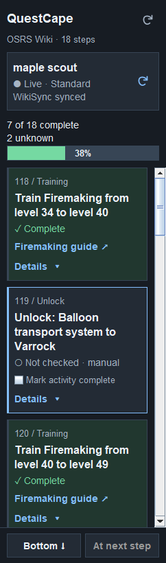

# QuestCape


A native RuneLite sidebar for the OSRS Wiki's standard optimal quest route. It loads the complete ordered table at runtime, keeps quests and interleaved training/activities visible, and tracks the current RuneLite account.

## Features

- Follow quests, miniquests, training and activities in the wiki's recommended order.
- See live quest and skill progress, with WikiSync for your current character.
- Open matching quests in Quest Helper using the button on each quest card.
- Expand row details, open training guides and check off manual activities.
- Jump to your next step or either end of the route, with cached content available offline.



The preview uses test fixture data. QuestCape is a development plugin; Plugin Hub availability is subject to maintainer review and acceptance. Build and run it from this repository using the instructions below.

**Development build:** guide content, live progress, current-player WikiSync, navigation, and training links are implemented. Each quest card has an **Open** button beside its step number/type, using Quest Helper's installed sidebar icon. It opens Quest Helper's existing tab and fills its search field. When exactly one result is displayed, the plugin presses that result's arrow; choose manually between multiple matches. Any assist or branch setup is handled by Quest Helper. Confirmed login resume remains **unavailable** against the verified distributed Quest Helper 4.17.0 build; searching or pressing a result's arrow does not record a confirmed resume target.

## Development setup

Use a JDK compatible with Gradle 8.10. Java 11 bytecode is generated. This build was verified with Temurin 11.0.22 and RuneLite 1.12.38, resolved from the template's `latest.release` selector. The wrapper comes from `runelite/example-plugin` commit `5370caa0f5f6a5bba4fbb42931722ca535ad3fd5`.

```powershell
git clone https://github.com/EyalMK/QuestCape.git
cd QuestCape
./gradlew.bat build
./gradlew.bat run
```

On macOS/Linux use `./gradlew`. Enable **QuestCape** in the development client's plugin settings. Install and enable **WikiSync** and **Quest Helper** through that client's Plugin Hub. This plugin does not change their settings. For Jagex accounts, follow [RuneLite's development-client login instructions](https://github.com/runelite/runelite/wiki/Using-Jagex-Accounts); credentials are never entered into this plugin.

If you have multiple JDKs installed, set `JAVA_HOME` to your Java 11 installation before running Gradle.

The Java package and Gradle group are `com.questcape`. RuneLite loads `QuestCapePlugin`, settings are defined in `QuestCapeConfig`, and the development `run` task starts `QuestCapeLauncher`. Configuration uses the `questcape` group and local data is stored under `.runelite/questcape/`.

## Using the sidebar

- Open **QuestCape** from the sidebar's gold map with a blue route arrow.
- Your current character appears after account/profile readiness. WikiSync runs once on login and when you click the account's **Sync icon**. There is no other-player lookup field. Hops do not repeatedly resync the same established session.
- The top **refresh icon** retrieves the latest wiki route. Account sync and route freshness are separate.
- Green plus a checkmark means complete; blue marks in-progress/next-step context; neutral labels distinguish incomplete, unknown, and unchecked manual activities. All completed rows stay visible.
- Click a card's title, background, metadata or status to expand/collapse notes and source fields. **Details**, Enter or Space on the focused card do the same. **Open**, links and checkboxes retain their separate actions. Wiki projections never determine your real progress.
- Text is larger throughout: 13 pt metadata, 14 pt body/navigation, 16 pt titles, and an 18 pt header. The top progress bar is 22 pixels tall and shows the completion percentage.
- The fixed bottom controls jump to the **top/bottom** based on your position, or to the **next step** (first in-progress quest, otherwise earliest unfinished action). Arrows show which direction it is. Keyboard: Ctrl+Home, Ctrl+End, Ctrl+J. Ordinary updates do not move the viewport.
- Training links open the relevant Theoatrix guide. Compound steps expose each skill. Unmapped destinations use the explicitly labeled all-guides fallback. Native browser failures use RuneLite's copy-link recovery; synchronous errors also show a retry/copy message.
- The compact **Open** button beside the step number/type opens the existing Quest Helper tab and searches for the matching quest/subquest. This uses its normal search field and, when needed, its existing view toggle to return from assist/settings to the quest list. Exactly one visible result opens through its own arrow; zero or multiple results remain for manual inspection. Quest Helper's existing filters and assist/branch setup still apply. Login/dependency/search feedback appears immediately above the clicked card. Missing or changed search UI produces a recoverable message without changing other fields.

## Progress and synchronization

Live progress uses `Quest.getState(Client)` and `Client.getRealSkillLevel(Skill)` on `ClientThread`. Observations are scoped to the established RuneLite RS profile and game mode. WikiSync uses exactly:

```text
GET https://sync.runescape.wiki/runelite/player/{player_name}/STANDARD
```

The current name is trimmed, spaces become underscores, then it is encoded as one URL path segment. `maple scout` and `maple_scout` both address `/maple_scout/STANDARD`. Every explicit Sync requests current API data even with a cache. Live observations take precedence. Non-standard profiles do not consume STANDARD remote data. API retrieval time and server observation time are recorded separately; a recent retrieval does not guarantee a recent upload. WikiSync owns uploads; this companion adds none.

Quests, subquests, and pure training thresholds use authoritative observations. A separate **start** stage becomes complete once that quest is in progress; its later finish stage remains unfinished. Unknown mappings stay unknown. Unlocks, diaries and reward hand-ins without verified state predicates use reversible **manual** checks. Skill levels never prove a reward was collected. Indistinguishable repeated activities remain visible, but cannot share a manual check. Manual records follow unchanged action identities across reordering; altered actions or targets are not guessed to match old records.

## Cache and settings

Data is under `.runelite/questcape/`: versioned `guide/` content and separate `progress/` account records. The plugin loads validated cache immediately, revalidates after 24 hours, and keeps the previous snapshot when requests/parsing fail. Refreshes coalesce and use a five-second cooldown, conditional headers, bounded response sizes, and timeouts. Unknown schemas are retained rather than deleted. HTTP failures show age/status; no-data responses are not interpreted as zero completion.

**Resume quest on login** is a normal persistent RuneLite setting, enabled by default. **Clear remembered quest** is separate. Versioned intent records include the account/profile, mode scope, canonical quest, and confirmation time in this plugin's RS-profile configuration. The coordinator waits up to 50 game ticks for readiness, suppresses duplicate/hop launches, respects an already active helper, and drops stale account work. Turning resume off cancels pending automatic work; enabling it applies at the next login. Manual selections remain independent of this preference. These lifecycle rules have local adapter tests. Because no compatible bridge is verified, no successful launch or automatic resume is currently performed.

## Verification and distribution

```powershell
./gradlew.bat build
./gradlew.bat verifyRemoteContracts
./gradlew.bat resolvedVersions
```

`verifyRemoteContracts` checks the wiki HTTP adapter. To also check WikiSync, explicitly supply your chosen account with `-PwikiSyncPlayer="YOUR PLAYER"`; no account is queried by default. It does not start RuneLite or perform game actions. Automated tests cover parsing/cache, progress/isolation, persistence, dependency transitions, resume coordination, plugin lifecycle, unavailable bridge behavior, links, resources, and the scroll regression. Fixtures and previews use the fictional name `maple scout`. The user confirmed that in-game Sync works on 2026-09-12. Narrow Swing previews are generated at `build/ui-evidence/`. See [verification evidence](docs/verification.md) and the [scenario audit](docs/scenario-audit.md).

The distribution is `build/libs/questcape-0.1.0.jar`. `build=standard` is retained. Main code uses only Java 11 and the client-provided classpath; the inert HTML DOM uses the JDK parser, with no jsoup/custom runtime dependency. Tests and any development fat JAR are not Plugin Hub artifacts. The ordinary JAR includes only this plugin's classes, resources, metadata, and notices, with no Quest Helper or WikiSync classes. Packaged resources use `getResourceAsStream`.

Source repository: [EyalMK/QuestCape](https://github.com/EyalMK/QuestCape). The root `icon.png` is a transparent 32 x 32 PNG, within the Plugin Hub's 48 x 72 pixel limit. Plugin Hub listing requires a separate manifest submission and maintainer review, following the [official publishing instructions](https://github.com/runelite/plugin-hub#submitting-a-plugin). Local build checks do not constitute Plugin Hub approval.

Code is BSD-2-Clause. Wiki content is attributed to OSRS Wiki contributors under CC BY-NC-SA 3.0 and applicable additional terms; see [THIRD-PARTY-NOTICES.md](THIRD-PARTY-NOTICES.md). Captured account/content fixtures are test resources, excluded from the distribution JAR.
