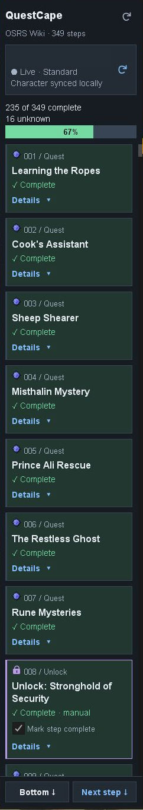
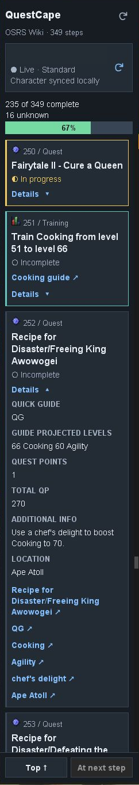
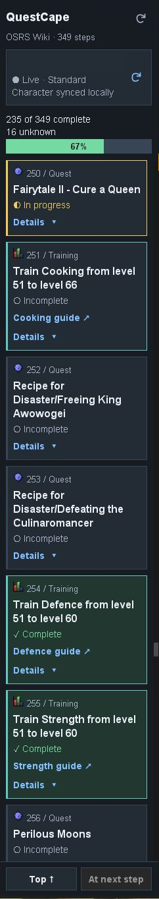

# QuestCape

**Your next step toward the Quest Cape.**

Follow the [OSRS Wiki's optimal quest guide](https://oldschool.runescape.wiki/w/Optimal_quest_guide) right inside RuneLite. QuestCape keeps quests, training and activities in order, tracks your progress, and helps you pick up where you left off.

- **Know what's next.** Jump straight to your next unfinished step.
- **Watch your progress grow.** Quests and skill levels update automatically for your logged-in character.
- **Keep everything together.** Expand quest notes, open wiki and training guides, and check off manual activities.
- **Come back anytime.** Progress stays saved per character, and the cached route works offline.

**Track progress · Read quest notes · Find your next step**

  
  
  

*Captured from RuneLite with the player name hidden.*

## Get started

Search **QuestCape** in RuneLite's **Plugin Hub**, install it, then open the gold map icon in your sidebar. Log in and your character's progress will sync automatically.

Character progress stays on your computer; no external account is needed.

## What's next

- Open the matching **Quest Helper** directly from a quest card.
- Remember your selected quest so you can resume it next session.

*Planned features; Quest Helper integration depends on a supported upstream API.*

By **ElyMK** · [Feedback & suggestions](https://github.com/EyalMK/QuestCape/issues) · [Development & usage](docs/development.md)

Code: BSD-2-Clause. Guide content: OSRS Wiki contributors, CC BY-NC-SA 3.0 and applicable additional terms. [Attribution](THIRD-PARTY-NOTICES.md).
